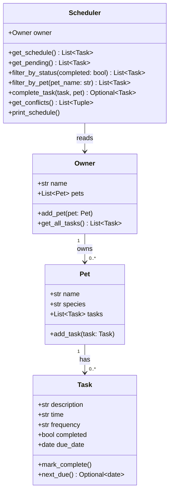

# PawPal+ (Module 2 Project)

You are building **PawPal+**, a Streamlit app that helps a pet owner plan care tasks for their pet.

## Scenario

A busy pet owner needs help staying consistent with pet care. They want an assistant that can:

- Track pet care tasks (walks, feeding, meds, enrichment, grooming, etc.)
- Consider constraints (time available, priority, owner preferences)
- Produce a daily plan and explain why it chose that plan

Your job is to design the system first (UML), then implement the logic in Python, then connect it to the Streamlit UI.

## What you will build

Your final app should:

- Let a user enter basic owner + pet info
- Let a user add/edit tasks (duration + priority at minimum)
- Generate a daily schedule/plan based on constraints and priorities
- Display the plan clearly (and ideally explain the reasoning)
- Include tests for the most important scheduling behaviors

## Smarter Scheduling

Phase 4 adds algorithmic intelligence to the `Scheduler` class in `pawpal_system.py`:

- **Sorting** — `get_schedule()` sorts all tasks by their `HH:MM` time string so the daily plan always reads chronologically regardless of the order tasks were added.
- **Filtering** — `filter_by_pet(name)` returns tasks for a single pet; `filter_by_status(completed)` returns only done or only pending tasks.
- **Recurring tasks** — `complete_task(task, pet)` marks a task done and, for `daily` or `weekly` tasks, automatically creates the next occurrence using `timedelta` and attaches it to the pet.
- **Conflict detection** — `get_conflicts()` scans all tasks for exact time-slot collisions and returns warning messages for each pair, rather than crashing the program.

---

## Features

- **Sorting by time** — `Scheduler.get_schedule()` returns all tasks sorted by `HH:MM` time string so the daily plan always reads chronologically, regardless of the order tasks were added.
- **Conflict warnings** — `Scheduler.get_conflicts()` scans for exact time-slot collisions across all pets and surfaces a `st.warning` banner for each conflicting pair, so the owner can resolve overlaps before the day begins.
- **Daily recurrence** — `Scheduler.complete_task()` marks a task done and automatically creates the next occurrence (shifted by `timedelta`) for `daily` and `weekly` tasks, so recurring care never needs to be re-entered manually.
- **Filtering** — `filter_by_pet(name)` and `filter_by_status(completed)` let the UI or tests quickly narrow the task list without scanning the full schedule.
- **Multi-pet support** — an `Owner` can have any number of `Pet` objects; every pet's tasks are aggregated into one daily view, grouped by pet.

## System Architecture



## Demo

<a href="/course_images/ai110/pawpal_screenshot.png" target="_blank"></a>

---

## Getting started

### Setup

```bash
python -m venv .venv
source .venv/bin/activate  # Windows: .venv\Scripts\activate
pip install -r requirements.txt
```

### Run the app

```bash
streamlit run app.py
```

### Run tests

```bash
pytest
```

### Suggested workflow

1. Read the scenario carefully and identify requirements and edge cases.
2. Draft a UML diagram (classes, attributes, methods, relationships).
3. Convert UML into Python class stubs (no logic yet).
4. Implement scheduling logic in small increments.
5. Add tests to verify key behaviors.
6. Connect your logic to the Streamlit UI in `app.py`.
7. Refine UML so it matches what you actually built.
